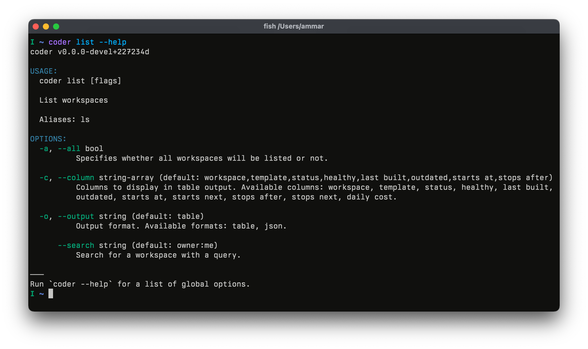

# serpent

[](https://pkg.go.dev/github.com/coder/serpent)

`serpent` is a Go CLI configuration framework based on [cobra](https://github.com/spf13/cobra) and used by [coder/coder](https://github.com/coder/coder).
It's designed for large-scale CLIs with dozens of commands and hundreds
of options. If you're building a small, self-contained tool, go with
cobra.



When compared to cobra, serpent strives for:

* Better default help output inspired by the Go toolchain
* Greater flexibility in accepting options that span across multiple sources
* Composition via middleware
* Testability (e.g. OS Stdout and Stderr is only available to commands explicitly)

## Basic Usage

See `example/echo`:

```go
package main

import (
	"os"
	"strings"

	"github.com/coder/serpent"
)

func main() {
	var upper bool
	cmd := serpent.Command{
		Use:   "echo <text>",
		Short: "Prints the given text to the console.",
		Options: serpent.OptionSet{
			{
				Name:        "upper",
				Value:       serpent.BoolOf(&upper),
				Flag:        "upper",
				Description: "Prints the text in upper case.",
			},
		},
		Handler: func(inv *serpent.Invocation) error {
			if len(inv.Args) == 0 {
				inv.Stderr.Write([]byte("error: missing text\n"))
				os.Exit(1)
			}

			text := inv.Args[0]
			if upper {
				text = strings.ToUpper(text)
			}

			inv.Stdout.Write([]byte(text))
			return nil
		},
	}

	err := cmd.Invoke().WithOS().Run()
	if err != nil {
		panic(err)
	}
}
```

## Design
This Design section assumes you have a good understanding of how `cobra` works.

### Options

Serpent is designed for high-configurability. To us, that means providing
many ways to configure the same value (env, YAML, flags, etc.) and keeping
the code clean and testable as you scale the number of options.

Serpent's [Option](https://pkg.go.dev/github.com/coder/serpent#Option) type looks like:

```go
type Option struct {
	Name string
	Flag string
	Env string
	Default string
	Value pflag.Value
	// ...
}
```

And is used by each [Command](https://pkg.go.dev/github.com/coder/serpent#Command) when
passed as an array to the `Options` field.

## Comparison with Cobra

Here is a comparison of the `help` output between a simple `echo` command in Cobra and Serpent.

### Cobra

```
echo is for echoing anything back. Echo works a lot like print, except it has a child command.

Usage:
  echo [string to echo] [flags]

Flags:
  -h, --help    help for echo
  -u, --upper   make the output uppercase
```

### Serpent

```
USAGE:
  echo <text>

  Prints the given text to the console.

OPTIONS:
      --upper bool
          Prints the text in upper case.
```

## Migrating from Cobra

Serpent is designed to be a replacement for Cobra and Viper. If you are familiar with Cobra, the transition to Serpent should be relatively straightforward. The main differences are:

*   **Command Structure:** Serpent uses a `serpent.Command` struct which is similar to `cobra.Command`.
*   **Options:** Serpent has a more flexible and powerful option system that allows you to define options from multiple sources (flags, environment variables, config files, etc.) in a single place.
*   **Middleware:** Serpent has a middleware system that allows you to compose functionality and apply it to your commands.
*   **Testability:** Serpent is designed to be more testable than Cobra. For example, OS stdout and stderr are only available to commands explicitly.

## Serpent vs. Cobra and Viper

Serpent is intended to be a complete replacement for both Cobra and Viper. While Viper is often used with Cobra to provide environment and config file support, Serpent has this functionality built-in. This results in a more integrated and streamlined experience.

## Examples

For a more comprehensive example of a large-scale CLI built with Serpent, please see the [coder/coder](https://github.com/coder/coder) repository.